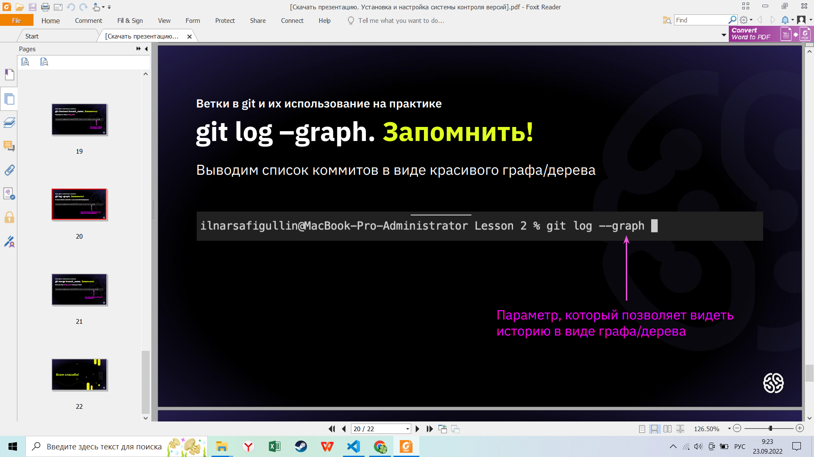
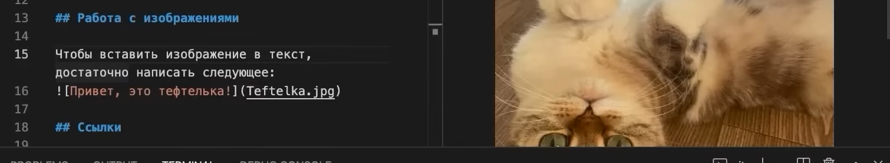

# Инструкция для работы с Git и удалёнными репозиториями

## Что такое Git?
Git - это одна из реализаций распределённых систем контроля версий, имеющая как и локальные, так и удалённые репозитории. Является самой популярной реализацией систем контроля версий в мире.
## Подготовка репозитория
Для создание репозитория необходимо выполнить команду *git init*  в папке с репозиторием и у Вас создаться репозиторий (появится скрытая папка .git)

## Создание коммитов

### Git add
Для добавления измений в коммит используется команда *git add*. Чтобы использовать команду *git add* напишите *git add "имя файла"*

### Просмотр состояния репозитория

###Git status

Для того, чтобы посмотреть состояние репозитория используется команда *git status*. Для этого необходимо в папке с репозиторием написать *git status*, и Вы увидите были ли измения в файлах, или их не было.

### Создание коммитов

### git commit -m "name"

Для того, чтобы создать коммит(сохранение) необходимо выполнить команду *git commit*. Выполняется она так: *git commit -m "cообщение к коммиту"*. Все файлы для коммита должны быть ***ДОБАВЛЕНЫ*** и сообщение к коммиту писать ***ОБЯЗАТЕЛЬНО***.

## Перемещение между сохранениями

### Git checkout

Для того, чтобы перемещаться между коммитами, используется команда *git checkout*. Используется она в папке с репозиторием следующим образом: *git checkout "номер коммита"*

## Журнал изменений

### Git log

Для того, чтобы посмотреть все сделанные изменения в репозитории, используется команда *git log*. Для этого достаточно выполнить команду *git log* в папке с репозиторием

## Ветки в Git

### Создание ветки git branch

Для того, чтобы создать ветку, используется команда *git branch*. Делается это следующим образом в папке с репозиторием: *git branch <название новой ветки>*

### Слияние веток git merge

Для того чтобы добавить ветку в текущую ветку используется команда *git merge "name branch"*

### Удаление веток
Для удаления ветки ввести команду *git branch -d "name branch"*

## Добавление изображения

*Для углубленного изучения Git перейти по ссылке внизу:*

[https://gbcdn.mrgcdn.ru/uploads/asset/4245110/attachment/d4eb8c232f8f2bdf4e42ba7cb49e0c50.pdf]

## Дополнительные команды GIT

* _git log --graph_ - журнал коммитов с визуализацией связей

* _git log -oneline_ - сокращенный список коммитов

## Команды терминала

* _git --help_ работы команды с разными флагами

* _cd "наименование папки"_ - замена директории

* clear -очистка терминала

# Удобная команда GIT

*  _git checkout -b "branch_name"_ - создает ветку и переходит в нее

